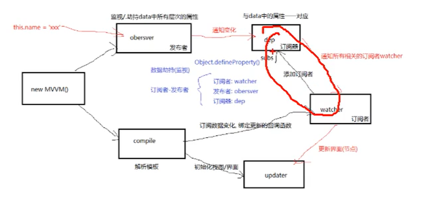

## vue2源码解析

### 数据代理 
    什么是数据代理？
    data对象的所有属性操作由vm(读/写实例对象)代理操作
    数据代理：vm._data.msg===>vm.msg
    优点？
    简化编码

    vm._data.name //不是数据代理的情况
    数据代理:
    vm.name //不需要通过中间_data，叫做代理读操作
    vm.name = "yy2" //代理写操作

    Object.keys(obj).forEach(key=>{
        console.log(obj[key])
    }) //key存的是key，不保存value，想要获取value，obj[key]

    
#### 数据代理面试总结(重要)：
    理解：
        什么是数据代理？
        通过vm直接操作vm内部的data的属性数据
        例子：this._data.msg //没有数据代理
              this.msg  //数据代理后
     作用：简化编码         

     原理：data(){
         return{
             msg:"xxx"
         }
     }
           通过defineProperty给vm添加与data中属性对应的同名属性
           给属性指定getter和setter
           在get方法中，读取data中msg属性值返回 ===》 当this.msg时调用
           在set方法中，将最新的msg值赋值给data的msg属性 ==> this.msg ="xxx"时调用

#### 模板解析
    模板解析有两种类型模板语法，插值和指令(事件指令和一般指令)
    插值:{{name}} 解析成：悟空

    1、模板解析基本流程：
        1)将el的所有子节点取出，添加到一个新建的文档fragment对象中
        2)对fragment中所有层次子节点递归进行编译解析处理
            *对插值文本节点进行解析
            *对元素节点的指令属性进行解析
                *事件指令解析
                *一般指令解析
        3)将解析后的fragment添加到el中显示      
    2、解析插值语法节点：textNode.textContent = value//value是根据插值语法表达式
        reg = /\{\{(.*)\}\}/;
        1)根据正则对象得到匹配出的表达式字符串：子匹配/RegExp.$1  
        2)从data中取出表达式对应的属性值
        3)将属性值设置为文本节点的textContent
    3、 事件指令解析：elmentNode.addEventListener("eventName",callback.bind(vm))

#### 模板解析面试总结(重要)：     
      1、模板解析只发生在初始化(生命周期created-beforemount中间这个阶段，因为需要data解析模板，这个阶段有data了)显示阶段，解析完后，模板代码没有了
      2、模板解析，研究如何实现初始化显示
      3、解析2种模板语法
          插值语法：操作文本节点：textNode.innerText = 动态值(根据{{a.b}}表达式，去对应data属性中取对应的值)，这里面用到了正则匹配,涉及到了子匹配(大的正则中找一部分)
          (正则获取的文本内容赋值给textNode.innerText(文本节点))
          指令语法：
            事件指令：给元素绑定指定事件名和回调的DOM事件监听：elment.addEventListener(type,callback.bind(vm))//type从v-on:click="xxx",click就是type(一种绑定)
            一般指令：(三种赋值)
            v-text element.innerText = 动态值
            v-heml elment.innerHTML = 动态值
            v-bind:class element.className = 动态值+静态class
      *4、解析每个模板语法(事件指令除外)都会创建一个对应的watcher对象，用于更新对应的节点      

### 数据绑定(和响应式同一个东西)
    1、一旦更新了data中某个属性数据，所有界面上直接使用或间接使用了此属性都会更新
    2、实现数据绑定的两个重要技术：
        1)数据劫持/监视：definePropperty监视data中所有属性，一旦数据变化就去更新界面
        2)订阅者-发布者模式：知道界面上哪些节点需要更新，并且去更新，所有相关节点
    3、四个重要对象
        1- observer
            发布者
            1)data中所有层次属性都添加get和set方法(数据劫持)
            2)为data中每个属性创建一个对应的dep对象
        2- Dep(在发布者内部)
            订阅器
            1)与data中属性一一对应的对象
        3- watcher(绑定在订阅上面)
            订阅者     
            有用于更新节点的回调函数
        4- compile 
            编译模板 + new Watcher()
        watcher可以看做：表达式{{name}}和v-text，dep可以看做属性
        dep和watcher关系，
        1 对 多 //watcher可以看做：表达式{{name}}和v-text，dep可以看做属性，一个属性对应多个表达式    
        多 对 1
        多 对 多
        例子：this.name= "xxx"
              ==>data中的name会变为xxx //数据代理
              ==>observer中的name的set方法调用
              ==>通过dep通知所有的watcher
              ==>watcher调用更新节点的函数，更新界面节点，该函数调用的cpmpile中的updater。
        

### 响应式原理(和数据绑定是同一个东西)
    1、相关理解
        1)响应式也就是数据绑定
        2)何为数据绑定/响应式？只要更新data中数据，响应的界面就会更新
    2、原理
        *搞清楚2个问题？
            ·如何知道data的属性变化了？
                 数据劫持：difineProperty给data中所有层次添加getter和setter
            ·如何知道当前这个数据变化要更新哪些节点？
                 订阅者-发布者模式：通过dep通知所有相关的watcher，调用更新节点相应得节点函数

        vue实现数据绑定的2个重要技术
            1)数据劫持/监视：definePropperty监视data中所有属性，一旦数据变化就去更新界面
            2)订阅者-发布者模式：知道界面上哪些节点需要更新，并且去更新，所有相关节点      
           (发布者Observer，订阅者watcher，Dep订阅器也是连接ob和wat的，通知订阅者)
        能独立画出响应式结构图(自己画)：
            new mvvm   Observer   dep
                       compile  updater watcher 
            
### 数据劫持(或者叫数据拦截)
    1、数据劫持是vue中用来实现数据绑定的一种技术
    2、基本思想：通过dedineProperty()监视data中所有属性(任意层次)数据的变化，7一旦变化更新界面      
    数据劫持是数据代理的一部分  

### vue的组件中data不能是对象
    1、组件如果是对象会报错，产生的原因是对象方式会造成全局污染，函数则不会    
    2、Vue的实例不会报错，Vue的实例则不会报错

### 图片懒加载
    图片过多影响页面加载速度，因此必须用懒加载
    
    vue-lazyload    

### sync修饰符的使用
    <!-- :money="money" @update:money='fn' -->
    <Button :money.sync=""></Button> //.symc === :money="money" + @update:money事件

    :visible.sync="visible" 相当于:visible="visible"+  @update:visible ="visible"
    //update:是vue隐式添加的属性，用于更新数据，节省了赋值

    this.$emit("update:visible",200) //visible变量就会修改为200

    .sync修饰符作用，可以修改xxx.sync时候xxx的属性

### self修饰符
    跳过冒泡

### 自定义指令
    1、创建directives文件夹
    2、创建自定义指令文件，并且暴露
    export default{
       bind:function(el,binding){
        const _ops = binding.value
        //获取子节点
        const _c = document.getElementsByClassName(_ops.className)
        el.children[_ops.currentIndex].className += `${_ops.activeClass}`
        console.log(el.children[_ops.currentIndex].className += `${_ops.activeClass}`)
        
    },
    update:function(el,binding){
        const _ops = binding.value
        const _oOps = binding.oldValue
        
        //获取子节点
        const _c = document.getElementsByClassName(_ops.className)
        el.children[_oOps.currentIndex].className = `${_oOps.className}`
        el.children[_ops.currentIndex].className += `${_ops.activeClass}`
    }
    }
    3、引入
        import NavActive from "@/directives/navActive"
    4、注册
        directives:{
            NavActive
        }    
    5、使用 NavActive指令(驼峰命名法，如果有大写字符需要-连接并且改成小写)
       
     
       自定义指令：一般传入子类的配置

