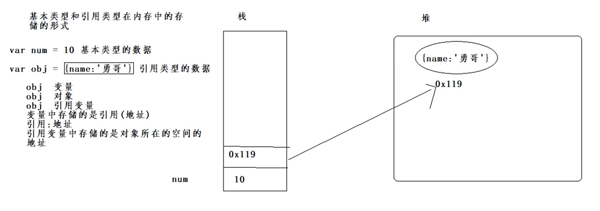
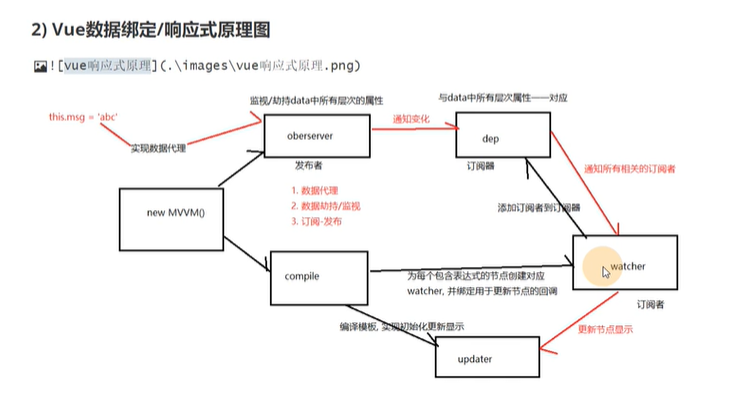
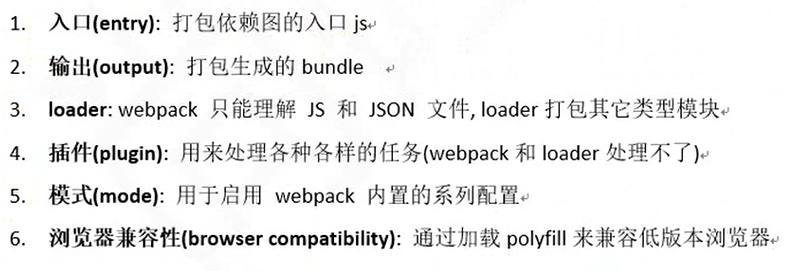

#重点要点
##基础内容
### 一）你对js的理解
    a=b 永远是把右边的值赋值给左边，可能是地址值也可能是基本数据类
#### 一、a.b的理解
	1、涉及到预解析、作用域、执行上下文、闭包、原型
#### 二、变量
	1、变量是个地址，里面存储基本类型数据和引用类型数据的地址
    例子: 
        var num = 10
        num = 20
    10本身没有变化，而是在num地址中20覆盖了10，基本数据类型中值本身是不可被改变的只能覆盖  
    

#### 三、基本类型数据和引用类型数据
    1、基本类型数据
    String、Number、Boolean、Undefined、null、Symbol、BigInt
    2、引用类型数据
    Object、Function、Array、Date、RegExp

    **基本包装类**
    var box =new String('Mr.Xiao');
    box.name="xiao";
    box变成了实例对象，box.name="xiao"，实例对象上可以添加属性

    
    **typeof**
    可以判断基本类型数据和引用类型数据，除了null和Array，这俩显示object

    **instanceOf**
    可以判断Object，左边是实例右边是原型,可以看成
    xxx.__proto__ instanceOf yyy.prototype
    正常写法：
    xxx instanceOf yyy

#### 变量和引用在内存中显示
    var a = {}
    栈：a -->堆：{} =：可以看做指针指向
    
    a是变量又称为引用变量

### 对象的理解    
    面向过程：亲力亲为，注重过程
    面向对象：提出需求，抽取对象，调用对象相关属性和方法，获取结果
    面向对象的特性：封装，继承，多态，(抽象性)
    对象：具体特指的某个东西
    特征---->属性
    行为----->方法
    对象:具有属性或者方法，特指的某个事物
    原型：
    引用变量：

    面向对象：
    1、提出需求，分析出具体事物的行为和特征并抽取出来，通过代码实现对象调用
    对应的属性和方法
    2、定义手机对象的类型(通过构造函数来定义，通过new构造函数，来实例化对象)
    
#### class类注意点
    sayhi(){} //添加的在原型方法
    eat=()=>{} //赋值方式添加的在实例身上

    new 做了哪些事？
    1、申请了内存空间
    2、this指向这个对象
    3、初始化属性和方法
    4、返回this指向的这个对象

#### 单例模式(学)
    function createObj(){
        var instance = null  //只执行进来的那次
        return function (name){
            if(!instance){
                instance = new Object()
                instance.name = name
            }
            return instance
        }
    }
    var getObj = createObj()
    var obj3 = getObj("小明")//创建一次同类对象，后面都是将obj3的地址给了obj4，obj5等等
    var obj4 = getObj("小红")
    解读：调用函数，判断有没有instance，如果没有则创建对象，并且添加name属性。
          如果有了则直接return instance
    作用：防止同一个对象重复创建      

## 原型
#### 原型理解
    1、函数定义执行
        console.log(fn)  return fn
    2、函数执行
        fn() //函数执行，必定函数定义执行了

    3、匿名对象：new Person() //未赋值的情况下叫匿名对象
    
    4、原型产生：函数执行定义的时候prototyp创建出来了，由于它的原型是对象(Object)的实例对象，因此__proto__也创建出来了
    
    5、函数中创建了新对象：则是堆内存中申请新空间，该函数在堆内存中的函数指向该对象

    6、继承： student.prototype = new Person()
    7、组合继承：继承+改变子构造函数中父的this，Person.call(this,name)

#### class类注意
    1、sex = "男"  sex=function(){}这是给实例属性添加的，不能写var否则报错
    2、sayhi(){}  这是给原型上添加
    3、static xxx   Person.xxx有值  实例身上person.xxx没值

## 执行上下文

### 作用
    全局作用域和局部作用域
    全局作用域：在任意的地方使用，局部作用域只能在局部使用
    函数定义完后，就有了作用域
    作用域链：将上一层作用域变量对象挂到当前作用域下，从内向外一层层查找

    重点：全局作用域想使用局部作用域变量，return 返出来的函数，复制一份地址给变量，变量调用，就可以在全局中调用局部作用域的函数
    ****创建作用域链和执行上下文有关系
    作用域链产生：函数在定义的时候自动添加一个属性[[Scopes]],该属性保存的是上一层作用域链
    -当函数执行的时候，进入执行上下文环境，将创建的变量对象添加到[[Scopes]]数组的第一个位置，形成新的数组
    
### 预解析
    1、如何证明预解析存在？
    变量赋值前调用变量没报错,console.log(num)  var num = 10
    2、变量声明提升和函数声明提升
    预解析过程中，函数和变量声明提升

### 执行上下文环境
    执行上下文环境流程：
    1、js引擎在js代码正式执行之前创建一个执行上下文环境
    2、进入该环境创建执行上下文环境的变量对象，用于收集：this,变量，函数，函数参数
    3、找关键词var，function(也就是预解析)
    4、确认this
    5、创建作用域链
    要点：
    1、在全局代码执行前，js引擎就会创建一个栈存储管理所有执行上下文
    2、全局执行上下文确定后，将其添加到栈中(压栈)
    3、函数执行上下文创建后，添加到栈中
    4、执行完毕出栈
    5、所有代码执行完毕，占中只剩下window
    重点：执行上下文是动态创建的，针对函数，每调用一次函数就会创建一个执行上下文
    作用域(全局和局部全部确定)--->预解析--->全局执行上下文环境---->全局执行上下文变量对象--->函数定义执行--->函数调用--->预解析--->局部执行上下文环境--->将创建的变量对象添加到'[[Scopes]]'数组的第一个位置，形成新的数组--->局部执行上下文变量对象--->调用完毕出栈，依次把变量对象干掉就结束了

### 闭包    
    闭包什么时候产生的？
    函数嵌套，外部函数调用，内部函数用到了外部函数变量，内部函数定义执行的时候产生了闭包
    return fn2  //fn是引用变量
    let f = fn() //fn返回值的变量赋值给f
    fn2被干掉了，但是地址值复制一份给了f,f不干掉他会一直指向fn2函数

    fn函数调用后,函数局部变量或者局部作用域中的所使用数据全部释放
    fn1函数调用后返回的fn2是引用变量，该变量存储的是fn2函数对象所在的空间地址
    此时fn2中存储的是一个地址，整个地址给了f，f存储的就是fn2函数对象所在空间的地址
    f和fn2中存的函数对象，还有这引用关系，既然有引用关系，fn函数调用后，内部数据被缓存起来了没有被释放，
    因此f函数可以再次进入fn2函数中(不是此时形成的闭包，而是此时用闭包)
    fn2中引用了fn函数的变量a，因为a有被指向的，a没被干掉

    手动缓存的函数闭包，需要手动释放指针指向null f=null， 指向该闭包的地址的都被干掉了才会真正释放

    定时器中闭包，时间到后产生闭包， clearTimeout释放闭包

#### function在栈内存
     function fn(){} fn则是在栈内存中， function(){}则在堆内存中

### 异步与同步
    界面渲染：
    界面第一次渲染：初始化同步代码--->所有微任务(promise)--->渲染界面--->执行第一个宏任务--->所有微任务——--》渲染界面--->执行第一个宏任务
    宏任务中回调执行，在界面渲染之后
    界面更新渲染：所有的微任务-->渲染界面--->执行第一个宏任务 

    事件轮询机制：
    通过事件轮询机制实现js的异步操作
    定时器、dom、ajax调用的时候，将函数放到对应的模块中，同步代码执行完毕执行队列中代码.
    注意定时器：定时器第二个参数时间，是xxs后把回调放入定时器模块。如果下面是只要循环，循环执行完毕立即执行回调。如果上面是循环，循环执行完毕，定时器调用等xxs后，放入定时器模块，执行回调。
    放在上面：执行完循环立马执行回调
    放在下面：执行完循环，等xxs后放入模块，等待执行
    

### Promise
    相对于纯回调的方式，更好的解决了嵌套回调。
    注意点：添加async的函数返回的都是promise对象
    Promise.all返回的是所有成功的值和状态 

## ES6
    ES6是2015年发布

#### ES5的创建对象并继承：
    Object.create(prototype,[descriptors])创建对象并继承属性
    Object.defineProperties

    Array的方法扩展
        1、indexOf 
        2、forEach
        3、map
        4、filter
    function fn(...args){}//args打包，...拆包    

### symbol:
    let symbol = Symbol("one")
    console.log(symbol)

    let obj={
        userName:"sdf",
        age:20
    }
    obj[symbol]="hello" //一定要[]，symbol是变量不能"."
    
    注意：symbol表示唯一属性，解决命名冲突

### iterator接口(迭代器)
    作用：为各种数据结构，提供一个统一的便捷的访问接口
          数据结构的成员能够被某个次序排列
    //模拟遍历器      
    function myIterator(arr){
            let nextIndex = 0 //指针初始位置
            return {
                //遍历器对象
                next:function(){
                    return nextIndex < arr.length?{
                        value:arr[nextIndex++],
                        done:false
                    }:{value:undefined,done:true}
                }
            }
        }

        let arr =[1,3,3,4,5,7]
        let interatorObj = myIterator(arr)
        console.log(interatorObj.next())
        console.log(interatorObj.next())
        console.log(interatorObj.next())
        console.log(interatorObj.next())
        console.log(interatorObj.next())      

### Generator函数
    没promise之前使用Generator函数
    async本质是generator函数

### 字符串扩展
    includes：判断中数组或字符串有没有指定字符串
### 数组扩展
    Array.from(伪数组转换成真数组)
    Array.of(1,2,3,4)(将一些数值放到数组中,包括对象)
    str.split()//将字符串转换为数组
    Array.find(找出第一个满足条件的元素)
    Array.findIndex(找出第一个满足条件的下标)

### 对象扩展
    Object.is(v1,v2) //判断里面是不是同一个值，引用数据类型或者基本数据类型都可以
    Object.assign(target,obj1,obj2)//浅拷贝,对象的属性复制到目标对象身上

### 浅拷贝和深拷贝    

### 事件冒泡
    事件流三个阶段：捕获、目标、冒泡
    父元素和子元素绑定相似事件(click和mouseStart)也会触发冒泡,

    300ms延迟问题
    问题：点击事件300ms后才会判断出是单机click或者双击缩放。
    解决方法：
    1、meta标签禁止缩放
    2、fastclick插件

    touch事件与穿透
    在移动端，手指点击一个元素，会经过：touchstart --> touchmove -> touchend --》click。
    touch事件是瞬发的，但是后面跟着会有300ms延迟的click事件
    解决方法：阻止遮罩的默认行为 e.preventDefault

## ajax
    ajax请求属于http请求，是特殊的http请求
    只有XHR和fetch发出的才是ajax请求
    
    ***AJAX通xmlHttpRequest象请求服务器服务器接受请求返数据实现刷新交互

    普通http请求通httpRequest象请求服务器接受请求返数据需要页面刷新

### xhr+promise封装一个异步ajax请求通用函数 
    简洁版：
    function ajax(url){
        return new Promise((resolve,reject)=>{
            const xhr = new XMLHttpRequest
            
            xhr.open("GET",url,true)

            xhr.onreadystatechange = function(){
                if(xhr.readyState !== 4){
                    return
                }
            }

            if(xhr.status >=200 && xhr.status<300){
                resolve(JSON.parse(xhr.responseText))
            }else{
                reject(new Error("request error status" + request.status))
            }
            xhr.send(null)
        })
    }

    加强版：
    function axios({url,params={},data={},method="GET"}){
        return new Promise((resolve,reject)=>{
            
            const request = new XMLHttpRequest
            
            let queryStr =Object.keys(params).reduce((pre,key)=>{
                pre += `&${key}=${params[key]}`
                return 
            },"")

            if(queryStr.length>0){
                queryStr = queryStr.substring(1)
                url +="?" + queryStr
            }

            method = method.toUpperCase()

            request.open(method,url,true)

            request.onreadystatechange= function(){
                if(request.readyState !== 4){
                    return
                }

                if(request.status >=200 && request.status<300){
                    const responseData={
                        data:JSON.parse(request.response),
                        status:request.status,
                        statusText:request.statusText
                    }
                }else{
                    const error =new Error("request error status"+ request.stutas)
                    reject(error)
                }
            }

            if(method === "POST" || method === "PUT" || method === "DELETE"){
                request.setRequestHeader("Content-Type","application/json;charset=utf-8")
                const dataJson = JSON.stringify(data)
                request.send(dataJson)
            }else{
                request.send(null)
            }

        })
    }

### 前台数据存储(自动登陆)
    cookie sessionStorage localStorage 
    //自动登陆：自动登陆相关代码    

    1、把token单独提出来提交
        commit(SAVE_TOKEN,user.token)
        将token存入本地 
          localStorage.setItem("token_key",user.token)//localStorage存的如果是对象需要用JSON.stringify包裹,字符串这不需要，解析时候 JSON.parse 
        把user中token删除  
          delete user.token
          commit(SAVE_USER,user)
     2、let token = localStorage.getItem("token_key")  
        路由中需要自动登陆的headers中添加needToken
        if(config.headers.needToken){
            if (token) {
                config.headers.authorization = token
            } else {
                throw Error("请先登录")
            }
        }   
      3、响应拦截器
        没发送出去就报错的情况，
         if (!error.response) {
            //没有发送请求已经报错
            alert(error.message)
            if (router.currentRoute.path !== "/login") {
                router.replace("/login")
            }
        } else {
            //发送请求返回错误
            if (error.response.status === 401) {
                alert("token过期.重新登陆")
                if (router.currentRoute.path !== "/login") {
                    router.replace("/login")
                }
            } else if (error.response.status === 404) {
                alert("没找到资源")
            }else{
                alert("请求错误")
            }
        }  

### 输入url许安然处页面过程
    1、DNS解析ip地址
    2、浏览器、计算机、路由器、网络运营商查找DNS缓存，没有则递归查询
    3、tcp连接三次握手，客户端->服务器 服务器-->客户端 客户端--<服务器> 数据开始传输
    4、发送请求将请求发送过去，返回响应将响应报文发送过来
    5、解析渲染界面
        遇到HTML，调用html解析器，解析成dom树
        遇到css，调用css解析器，解析成cssom树
        遇到js，调用js解析器(js引擎)，解析js代码
        修改元素节点和样式，重新调用对应 解析器，解析更新dom树和cssom
        DOM+cssom=渲染树

    6、断开连接tcp需要4次挥手    

## 手写代码多复习

## Vue相关API
    1、Vue.config.productionTip=false 控制浏览器控制台中的提示信息

    2、Vue.nextTick //swiper、文本框
        文本框点击文字内容自动获取光标，

        swiper组件，该组件对象必须等页面的dom加载完毕后，才可以创建swiper对象，页面dom是异步请求回来的，需要更新dom的，nextTick确认dom加载完毕后使用

        watch中使用Vue.nextTick()中的回调创建swiper，确保dom更新循环后执行回调

    3、Vue.set
        响应式数据：数据发生变化，页面随之渲染，此时这样的数据叫做响应式数据
        发送异步请求：返回数据数组保存到一个常量，常量赋值给this.对象 
        data(){
            return{
                dataList:[]
            }
        }

        const dataList = result.data
        dataList.forEach((item)=>{
            item.color = 'red' // color属性响应式数据
                               //原因:在赋值this.dataList前添加到dataList里面，赋值后保留
        }) 
        this.dataList = dataList
    总结：vue2添加响应式数据方式两种，1、set方法，2、data中对象赋值之前添加数据    

### vue中组件
#### Vue.mixin() //多个组件有相同代码   

    1、mixin.js文件
     export default{
         //想要暴露的代码
     }   

    2、引入文件
    //child.vue文件
    import mixin from "./mixin.js"
    export default {
        mixins:[mixin]
    }
    //该vue文件可以直接使用，mixin暴露的属性和方法了

#### 为什么data是函数而不是对象写法
    data函数一旦调用，data中数据是各个实例对象的数据。
    如果data是对象，多个组件则会共用一个data数据

#### props、computed、methods、watch
     接收父级组件传递过来的数据，实现父子组件通信
     computed 计算属性在组件中某个数据发生变化，相关联的数据会自动变化

     watch和computed区别：
        1)computed：组件加载时候计算属性会自动执行
        2)watch：组件加载时候，默认不执行，触发数据发生了变化才会执行,
        配置(immediate:true)则会里面执行
        3)监视是数据发生变化，需要做什么事情时候用监视，监视有深度监视，可以监视某一层数据"a.b.c":function(){}
        4)computed则是相关联
        5、使用场景
        computed 　　　　
    　　　　当一个属性 受多个属性影响的时候就需要用到computed
    　　　　最典型的例子： 购物车商品结算的时候
         watch
    　　　　当一条数据 影响 多条数据的时候就需要用watch
    　　　　搜索数据

#### 组件合集
    组件标签
    <component :is="currentComp"/>//:is存变量，is存常量
    <component is="Home"/>      //跟上面一样
    绑定btn切换currentComp，完成组件切换
    @click="currentComp="HOME"
    @click="currentComp="POST"

    动态组件
    const 组件名 = () => import('路径')//引入的组件是动态组件
    export default{
        data(){
            return{
                currentComp:"Home" //初始要显示的动态组件的名称(组件标签名)
            }
        }
    }
    //使用动态组件同样需要注册
    总结：
    函数const home=()=>import("路径")引入组件，
    <component :is="change">，:is属性变量为组件名称，可以切换
    并且需要注册组件

    缓存组件
    <keep-alive> 
    //包裹需要缓存的组件，被包裹的组件会缓存起来，缓存的组件切换的时候不会被销毁
    </keep-alive>
    使用场景：频繁切换组件，又不想组件重新创建。tab栏也可以使用缓存组件制作
    注意：股票类实时变化的千万不能用缓存

    异步组件
    settimeout(()=>{
        import("路径").then(module=>{
            console.log(module)
    })
    },2000)
    注意：异步组件是动态引入的，而不是静态引入，加载组件。页面展现出来后没有立刻使用某个组件而是延迟使用

    函数组件
    functional:true //代表该组件为函数式组件
    只有js，含有functional使组件无状态(没有data)a和无实例(没有this上下文)，使用render函数返回虚拟节点代价更小
    render(createEl,context){
        //context可以得到父级组件传来数据使用
        const {title,imgURL}=context.props
        if(title){
            vNodes.push()//jsx语法
        }
        return vNodes //返回包含多个虚拟dom的数值
        
    }

    递归组件
    组件内部调用自己实现数据的递归(展示)
    组件写name，然后再temp中 <组件名>

    路由组件
        路由：一种映射关系，地址和组件关系
        路由链接：router-link
        路由视图：router-view
    公共组件
      Vue.component()注册，任意组件中都可以直接使用
        
### 组件指令
    $el 
    $parent 父级组件
    $children 当前组件中直接的所有的子级组件
    $refs 可以获取某个标签对象
    $attrs 获取父级组件传递过来的所有的属性，不包括props接受的，class和style
    $listeners 获取父级组件传递过来的事件，native修饰是不要的        

    v-text 相当于dom中innerText
    v-html 相当于dom中innerHTML
    v-show 操作的是css中的display
    v-if   设置标签显示或者隐藏，在DOM数中是否存在标签
    v-slot插槽(普通插槽，命名插槽，作用域插槽)

    特殊属性：
    key
    ref 获取dom标签
    is 设置动态组件

    key：id作为key和index作为key的区别
    添加数据的时候：
        id：添加新数据，把key中标识取出来和id做对比
        index：前面插入数据，新插入的数据的索引替换了原来的索引，后面的索引全部+1变化

### vue中key内部原理
    1、虚拟dom的key的作用
    当列表数组中数据发生变化生成新的虚拟dom后，vue进行新旧虚拟domdiff比较
      a.key没有变化
        item数据没变，直接使用原来的真实dom
        item数据变化了。对原来的真实dom进行数据更新
      b.key变化     
        销毁原来的真实dom，根据item数据创建新的真实dom(即使item没变)

    2.key为index    
      1)添加/删除/排序=》产生没有必要的真实dom更新==>界面效果没问题，单效率地
      2)如果item有输入框=》产生错误真实dom更新=》界面有问题
      注意如果不存在添加/删除/排序操作，可以用index
    3、解决：
        使用id作为标识  

### 生命周期
     易忘：errorCaptured  子孙组件报错的声明周期回调
        errorCaptured 生命周期写在父组件，捕获子孙组件的错误信息

            errorCaptured(err,child,info){//child表示哪个子级组件，info表示什么事件分发的
                return false //表示不在向外传递
            } 

     缓存组件：激活和失活的声明周期
        <keep-alive>
            //缓存组件
        </keep-alive>
        激活：activated    //初始显示后，再回到当前路由
        失活：deactivated //缓存并且没有使用，进入这个生命周期
        用到了缓存 

    beforeUpdate和updated
    注意：表示的是数据+界面更新的前后
    beforeUpdate 数据修改开渲染之前
    updated 界面渲染完毕之后    

### 父子组件生命周期执行顺序
    初始化：
    父beforeCreate
    父created
    父beforeMount
    子beforeCreate
    子created
    子beforeMount
    子mounted
    父mounted

    更新:
    父beforeUpdate
    子beforeUpdate
    子updated
    父update

    销毁
    父beforeDestroy
    子beforeDestroy
    子destroyed
    父destroyed

    destroyed 和 v-if同样可以销毁组件

    

### 声明周期思路(重要*)
    1、声明周期个数，作用
    2、声明周期执行过程(最好结合父子组件)
    3、叙述整个生命周期流程(源码)    
        1)new vue() 创建组件的实例对象
        开始进行实例化操作
        2)beforeCreate 开始执行，data和methods还未初始化
        3)进入created中，此时data和methods初始化完毕(数据代理结束 Object.defineProperty),数据劫持已经结束。Object.definProperty,把data中数据遍历了，添加到劫持对象的data上，还创建了dep对象，data中有一个属性就会对应一个dep对象
        4)进入beforeMount之前，开始进行模板解析。
            a.创建虚拟DOM对象，把el中对应的HTML的根节点加入到虚拟的dom对象容器中，遍历所有子节点，判断节点是标签还是文本，如果是文本，再看是不是插值，标签中的文本替换，如果是标签，获取标签中的所有属性，判断属性是不是vue的指令，如果是指令，判断这个指令是不是普通指令还是事件指令。最终都会进入到bind方法中，创建watcher监视对象，内部会获取html标签中表达式的值，此时会建立dep对象和watcher对象关系。
            1对1
            1对多
            多对1
            多对多
            data中一个属性对应一个dep
            html模板中，一个表达式对应一个watcher对象
            最终会调用update对象中方法进行解析最后的替换操作
            mounted结束，页面就渲染完毕

### 组件通信(重要)
    props ----父子组件/子父也可以(父组件传入函数，子组件调用函数，数据传给父组件)
    vue自定义事件 ---父子组件
    全局事件总线 --- 任意组件
    v-model ----父子组件 ，本质input+value属性
    .sync ---父子组件
    $attrs与$listeners ---父子组件
    $refs,$children与$parent --- 父子组件
    provide(提供)与inject(注入)  --- 父和子孙
    vuex ---- 任意组件
    插槽 ===>作用域插槽  父子-子父
    pubsub   ---任意组件

### vue的响应式(重要*)
    重要问题
    

### vuex
    mutations中写异步代码可以执行(没测试)
    action中可不可以调用某个action，dispach() //没问题

### 插槽
    1、作用域插槽：
    home组件：<slot name="left" :person="person">{{person.lastName}}</slot>

    父组件：<template v-slot:left="slotProps">
                {{slotProps.person.lastName}}
            </template>
    //子传父需要        
    2、默认插槽：
    子组件<home>：<slot></slot>
    父组件：<home>
             
默认插槽
//默认插入到slot中
            </home>
    3、具名插槽<home>：
              <slot name="left">这里面是后背插槽</slot>  
              <slot  name="right"></slot>  
    父组件：<home>
                
行高

                
行高

            </home>
    具名插槽template方式：
            <home>
            <template v-slot:left="">//:name</template>
            <template v-slot:right="">
            </home>
### 路由组件
    1、路由子组件:父组件相同，子组件内容不同时候可以配合命名视图使用
        routes:[
            {
                path:"/"
                components:{
                    default:foo,
                    d:bar,
                    b:baz
                }
            }
        ]
        //两个视图：对应路由中name，bar则是组件名
        <router-view name="d"></router-view>
        <router-view name="b"></router-view>
        可用于：活动组件，活动时候使用改组件，结束拆掉
        注意：要在当前路由路径下才能使用子子路由
### 路由问题
    1、重复点击路由报错
        完全解决办法：路由注册中重写push和replace+捕获异常
        const routerPush = Router.prototype.push
        Router.prototype.push = function push(location) {
        return routerPush.call(this, location).catch(error=> error)
    2、捕获异常       
        this.$router.push(route).catch(err => {
            console.log('输出报错',err)
        })    
    3、补齐router第三个参数    
        this.$router.push(route, () => {}, (e) => {
            console.log('输出报错',e) 
        })    

     prefetch预加载 preload也是预加载
     link文件中ref="prefetch" ref="preload" 提前将文件加载进来 配合缓存组件或者懒加载更好

### 路由守卫
    全局路由守卫 前置beforeEach 解析beforeResolve 后置afterEach
    组件内部路由守卫 前置beforeRouteEnter 更新beforeRouterUpdate 离开beforeRouteLevea 

    全局前置守卫beforeEach 路由跳转前，beforeEach就会调用，next()不调用就跳转不了界面

    导航被触发。(离开页面-进入新页面)
    在失活的组件里调用 beforeRouteLeave 守卫。
    调用全局的 beforeEach 守卫。
    在重用的组件里调用 beforeRouteUpdate 守卫 (2.2+)。(如果是复用页面)
    在路由配置里调用 beforeEnter。
    解析异步路由组件。
    在被激活的组件里调用 beforeRouteEnter。
    调用全局的 beforeResolve 守卫 (2.5+)。
    导航被确认。
    调用全局的 afterEach 钩子。
    触发 DOM 更新。
    调用 beforeRouteEnter 守卫中传给 next 的回调函数，创建好的组件实例会作为回调函数的参数传入。   
        
### 全局路由守卫(登陆)
  //项目路由跳转

    const checkPaths = ["/trade","/pay","/center"]
    router.beforeEach(async(to,from,next)=>{
        //目标路由地址
        const targetPath = to.path 
        //获取需要检测地址
        const needPath = checkPaths.some(path=>targetPath.startWith(path))
        //获取用户信息对象及token数据
        let {userInfo,token} = store.state.userInfo
        //判断是否登陆
        if(userInfo.name){
            //放行
            next()
            //没有必要后面执行
            return
        }
        //没有用户新，没有登陆，判断token
        if(token){
            try{
                //自动登陆
                await store.dispath("getUserInfo")
                //此时自动登陆成功，正常方向
                next()
                //没有必要执行后面
                return
            }catch(error){
                //直接退出登陆
                store.dispath("logout")
                //提示信息
                Message.error("请重新登陆")
                //进入登录界面
                next("/login?redirect"+to.path)
                return
            }
        }
    
        //没有用户信息 没有token 检测路由地址, 谁都能登陆
        if(!needPath){
            //不需要检测
            next()
            return
        }
        next("/login?redirect="+to.path)
    })

    数组some方法和every方法
        some有一个真的就是真的，every有一个假的就是假的 //返回结果true或者false

### history404问题
    404报错问题：history：路由路径不带#，刷新会携带路由路径，默认会出404问题，需要配置返回首页
          hash：路由路径带#，刷新不会携带路由路径，请求的总是根路径，返回首页，没有404
        
    开发环境 前台：
    vue.config.js中
    module.exports{
        devServer:{
            historyApiFallback:true //出现404
        }
    }
    生产环境 后台：nginx
    location/{
        try_files $url $url/ /index.html; #所有404返回首页
    }
    总结：hash请求的总是请求根路径localhost:4000,history请求的则是localhost:4000/xxx/yy，我们并不需要发送请求是前台路由，他认为是后台发送请求报错

### webpack
#### webpack核心概念
    loader:只能理解js和json文件，loader打包其他类型转换
    插件：处理webpack和loader处理不了的任务
    模式：webpack内置模式
    

### 两个页面通信

    1、第一个页面
        let phone = {
            name:"iphonex",
            price:7000
        }
        localStorage.setItem("phone",JSON.stringify(phone))

    2、第二个页面    

        //此时不知道
    window.addEventListener("storage",()=>{
        //监视本地存储
        JSON.parse(localStorage.getItem("phone"))
    })  
    3、页面显示  
    window.addEventListener("pageshow",()=>{
        rem适配()
    })    
    4、窗口尺寸变化
        let stop
    window.addEventListener("resize",()=>{
        //加个防抖  
           stop && clearTimeOut(stop)
           stop =setTimetout(()=>{
               rem适配()
           },100)
    })    

#### vuex刷新
    vuex数据保存在运行内存中，vue实例初始化为期分配内存
    刷新页面的时候重新分配内存、
    解决问题：
    在页面刷新之前绑定unload事件
    vuex中数据保存到sessionStorage中

### 适配
    适配原因
    1、手机默认网页宽度980
    2、手机机型不同视觉视口不一样
    适配目的
    1、一张设计稿在不同机型呈现效果一样
    如何适配
    1、viewport适配（解决布局视口大于视觉视口问题） 布局时刻=视觉视口 content="width = device-width user-scalable=no"
    2、rem适配(解决机型屏幕不一样问题)
        以根节点字体作为参照进行适配
        clientWidth = document.documentElement.clientWidth
        rem = clientWidth/10
        document.documentElement.style.fontSize = rem +"px"
        document.body.style.fontSize="16rpx"//body不改变也会随rem值一样

### 冒泡排序
            